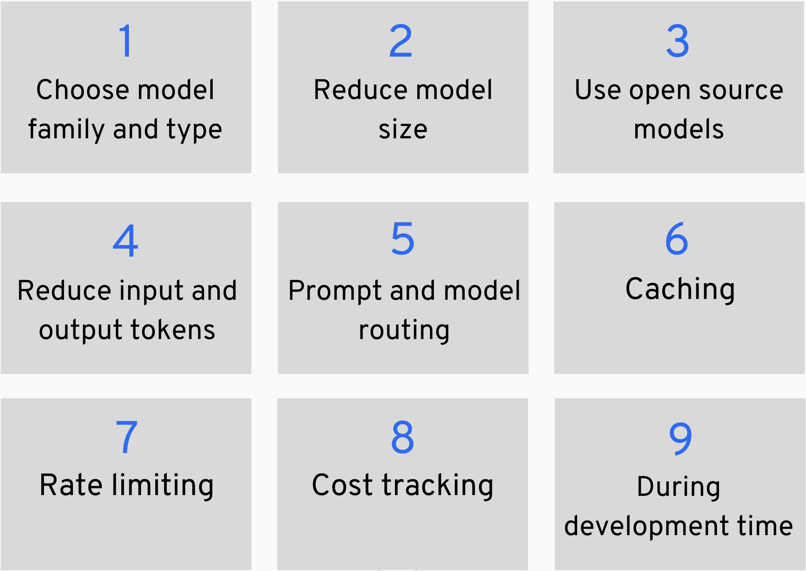

  <h1>awesome-cheap-llms</h1>
  

    :yellow_heart: <a href="https://www.canva.com/design/DAGAzJWIcnw/FIWWonF55d9FARA57xT8vg/edit?utm_content=DAGAzJWIcnw&utm_campaign=designshare&utm_medium=link2&utm_source=sharebutton">Costs of RAG based applications</a>  
    :blue_heart: <a href="https://www.linkedin.com/in/joannastoffregen/">Follow Joanna on LinkedIn</a> :heavy_plus_sign: <a href="https://www.linkedin.com/in/magdalenakuhn/">Follow Magdalena on LinkedIn</a>  
    :white_heart: <a href="https://github.com/DataTalksClub/llm-zoomcamp">Sign up to DataTalksClub LLM Zoomcamp</a>  
  

 

    

:point_right: Let’s make sure that your LLM application doesn’t burn a hole in your pocket.  
:point_right: Let’s instead make sure your LLM application generates a positive ROI for you, your company and your users.

# Techniques to reduce costs

    

## 1) :blue_book: Choose model family and type 
Selecting a suitable model or combination of models builds the foundation of building const-sensible LLM applications.

### Papers 
* Naveed, Humza, et al. ["A comprehensive overview of large language models."](https://arxiv.org/abs/2307.06435?utm) arXiv preprint arXiv:2307.06435 (2023).
* Minaee, Shervin, et al. ["Large Language Models: A Survey."](https://arxiv.org/abs/2402.06196) arXiv preprint arXiv:2402.06196 (2024).
### Tools & frameworks
* [MTEB (Massive Text Embedding Benchmark) Leaderboard](https://huggingface.co/spaces/mteb/leaderboard) by Huggingface
* [Models](https://huggingface.co/models) by Huggingface
### Blog posts & courses
* [How to Evaluate, Compare, and Optimize LLM Systems](https://wandb.ai/ayush-thakur/llm-eval-sweep/reports/How-to-Evaluate-Compare-and-Optimize-LLM-Systems--Vmlldzo0NzgyMTQz?utm)
* :speaking_head: call-for-contributions :speaking_head: 

## 2) :blue_book: Reducing model size 
After chosing the suitable model family, you should consider models with fewer parameters and other techniques that reduce model size.
* Model parameter size 
* Quantization of models
* Higher degree of model customization (i.e. through RAG or fine-tuning) can achieve the same performance as a bigger model
* Distillation 

### Papers 
* :speaking_head: call-for-contributions :speaking_head:

### Tools & frameworks
* [LoRA](https://huggingface.co/docs/diffusers/training/lora#lora) and [QLoRA](https://medium.com/@dillipprasad60/qlora-explained-a-deep-dive-into-parametric-efficient-fine-tuning-in-large-language-models-llms-c1a4794b1766) make training large models more efficient
* :speaking_head: call-for-contributions :speaking_head:

### Blog posts & courses
* :speaking_head: call-for-contributions :speaking_head: 
## 3) :blue_book: Use open source models
Consider self-hosting models instead of using proprietary models if you have capable developers in house. Still, have an oversight of Total Cost of Ownership, when benchmarking managed LLMs vs. setting up everything on your own. 

### Papers  
* :speaking_head: call-for-contributions :speaking_head: 
### Tools & frameworks
* [LocalAI](https://github.com/mudler/LocalAI)
* [Ollama ](https://github.com/ollama/ollama)
* [vLLM](https://github.com/vllm-project/vllm)
* [llama.cpp](https://github.com/ggerganov/llama.cpp)
* :speaking_head: call-for-contributions :speaking_head: 
### Blog posts & courses
* :speaking_head: call-for-contributions :speaking_head: 
## 4) :blue_book: Reduce input/output tokens
A key cost driver is the amount of input tokens (user prompt + context) and output tokens you allow for your LLM. Different techniques to reduce the amount of tokens help in saving costs.
* Compression
* Summarization

### Papers  
* :speaking_head: call-for-contributions :speaking_head: 
### Tools & frameworks 
* [LLMLingua](https://github.com/microsoft/LLMLingua) by Microsoft for input prompt compression
* :speaking_head: call-for-contributions :speaking_head: 
### Blog posts & courses
* :speaking_head: call-for-contributions :speaking_head: 
## 5) :blue_book: Prompt and model routing 
Add automatic checks to route incoming user prompts to a suitable model. Follow Least-Model-Principle, which means to by default use the simplest possible logic or LM to answer a users question and only route to more complex LMs if necessary (aka. "LLM Cascading"). 

### Tools & frameworks
* Native implementation in Python of your custom logic 
* [Nemo guardrails](https://github.com/NVIDIA/NeMo-Guardrails) to detect and route based on intent 
* :speaking_head: call-for-contributions :speaking_head: 
### Blog posts & courses
* :speaking_head: call-for-contributions :speaking_head: 
## 6) :blue_book: Caching 
If your users tend to send very similar prompts to your LLM system, you can reduce costs by using different cachin techniques.
* :speaking_head: call-for-contributions :speaking_head: 
### Papers  
* :speaking_head: call-for-contributions :speaking_head: 
### Tools & frameworks 
* :speaking_head: call-for-contributions :speaking_head: 
### Blog posts & courses
* :speaking_head: call-for-contributions :speaking_head: 
## 7) :blue_book: Rate limiting 
Make sure one single customer is not able to penetrate your LLM and skyrocket your bill. Track amount of prompts per month per user and either hard limit to max amount of prompts or reduce response time when a user is hitting the limit. In addition, detect unnatural/sudden spikes in user requests (similar to DDOS attacks, users/competitors can harm your business by sending tons of requests to your model).
### Tools & frameworks 
* Simple tracking logic can be implemented in native Python 
* :speaking_head: call-for-contributions :speaking_head: 
### Blog posts & courses 
* :speaking_head: call-for-contributions :speaking_head: 
## 8) :blue_book: Cost tracking  
"You can't improve what you don't measure" --> Make sure to know where your costs are coming from. Is it super active users? Is it a premium model? etc.
### Tools & frameworks 
* Simple tracking logic can be implemented in native Python 
* :speaking_head: call-for-contributions :speaking_head: 
### Blog posts & courses
* :speaking_head: call-for-contributions :speaking_head: 
## 9) :blue_book: During development time 
* Make sure to not send endless API calls to your LLM during development and manual testing.
* Make sure to not send automated API calls to your LLM via automated CICD workflows, integration tests etc. 

# Contributions welcome 
* We’re happy to review and accept your Pull Request on LLM cost reduction techniques and tools. 
* We plan to divide the content into subpages to further structure all chapters.
  
